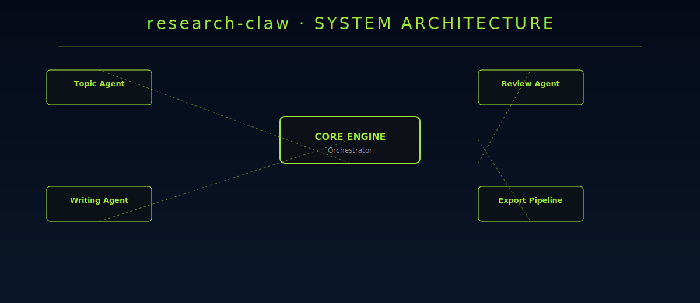

<div align="center">



</div>

## Multi-Agent Research Paper Factory

[](https://python.org/)
[](LICENSE)
[](https://github.com/disdorqin/research-claw/stargazers)
[](https://github.com/disdorqin/research-claw)
[](https://github.com/disdorqin/research-claw)

---

> research-claw is a multi-agent system that automates the research paper generation pipeline. From topic to publication-ready draft: it coordinates specialized agents for literature review, methodology design, experiment planning, writing, and review.

## Why research-claw Exists

Writing a research paper involves well-defined stages: survey, hypothesize, experiment, write, review. research-claw assigns each stage to a specialized agent — and coordinates them into a pipeline that produces publication-ready output.

## Features

- **Topic Agent** — takes a research direction and produces a structured literature survey  
- **Methodology Agent** — designs experiment methodology based on survey findings  
- **Experiment Agent** — generates experiment code and tracks results  
- **Writing Agent** — drafts paper sections following academic conventions  
- **Review Agent** — checks for consistency, gaps, and improvement opportunities  
- **Config-Driven** — YAML config defines the research scope and agent behavior  

## Architecture

<div align="center">
  
</div>

## Quick Start

```bash
# Clone and install
git clone https://github.com/disdorqin/research-claw.git
cd research-claw
pip install -e ".[dev]"

# Configure your research project
cp config.researchclaw.example.yaml config.researchclaw.yaml
# Edit with your research topic

# Run the pipeline
python -m researchclaw run --config config.researchclaw.yaml
```

## Example: From Topic to Draft

```bash
# 1. Define topic
echo "transformer models for electricity price forecasting" > topic.txt

# 2. Run literature agent
python -m researchclaw agent:literature --topic topic.txt
# → Produces literature_review.md

# 3. Run methodology agent
python -m researchclaw agent:methodology --review literature_review.md
# → Produces methodology.md

# 4. Run writing agent
python -m researchclaw agent:writing --all
# → Produces draft_paper.md
```

## Roadmap

- [x] Multi-agent orchestration
- [x] Literature review agent
- [ ] Methodology design agent
- [ ] Experiment generation agent
- [ ] Full paper writing agent
- [ ] Integration with DARIS and tsplab

## Tech Stack

Python · LangChain · LLM APIs · PyYAML · Academic APIs

## Star History

[](https://star-history.com/#disdorqin/research-claw&Date)

## Contributing

See [CONTRIBUTING.md](CONTRIBUTING.md).

## License

MIT — see [LICENSE](LICENSE).
