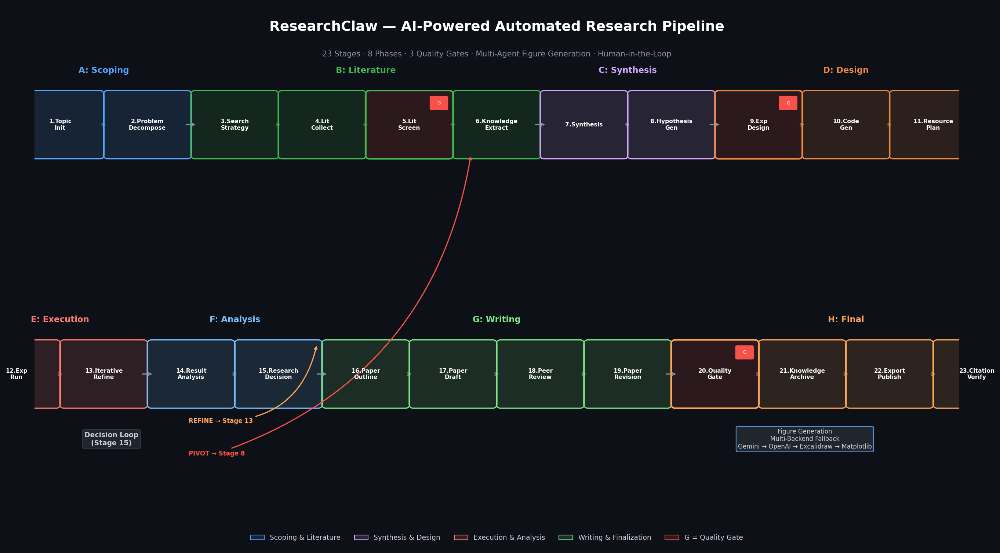

<p align="center">
  
</p>

<h1 align="center"><b>ResearchClaw</b></h1>

<h3 align="center"><i>AI-Powered End-to-End Automated Research Paper Generation</i></h3>

<p align="center">
  <b>From a single research idea to a conference-ready paper — fully autonomous or with human-in-the-loop collaboration.</b>
</p>

<p align="center">
  <a href="LICENSE"></a>
  <a href="https://python.org"></a>
  <a href="#pipeline"></a>
  <a href="#figure-generation"></a>
  <a href="#human-in-the-loop"></a>
</p>

<p align="center">
  <a href="docs/README_CN.md">🇨🇳 中文</a> ·
  <a href="docs/README_JA.md">🇯🇵 日本語</a> ·
  <a href="docs/README_KO.md">🇰🇷 한국어</a> ·
  <a href="docs/README_FR.md">🇫🇷 Français</a> ·
  <a href="docs/README_DE.md">🇩🇪 Deutsch</a> ·
  <a href="docs/README_ES.md">🇪🇸 Español</a> ·
  <a href="docs/README_PT.md">🇧🇷 Português</a> ·
  <a href="docs/README_RU.md">🇷🇺 Русский</a> ·
  <a href="docs/README_AR.md">🇸🇦 العربية</a>
</p>

---

## 🎯 What Is ResearchClaw?

**ResearchClaw** is an AI-powered research automation framework that transforms a research idea into a complete, publication-ready academic paper. Built on a **23-stage pipeline** spanning 8 phases, it integrates cutting-edge LLM capabilities with multi-agent collaboration, real literature retrieval, sandboxed experiment execution, and intelligent figure generation.

Unlike simple LLM chatbots that generate text, ResearchClaw orchestrates the **entire research workflow**:

- 📚 **Real literature** from OpenAlex, Semantic Scholar & arXiv — no hallucinated references
- 🧪 **Sandboxed experiments** with GPU/MPS/CPU auto-detection and self-healing code
- 📊 **Multi-backend figure generation** — Gemini → OpenAI Image → Excalidraw → Matplotlib fallback chain
- 🔍 **4-layer citation verification** — arXiv, CrossRef, DataCite, and LLM relevance scoring
- 🧑‍✈️ **Human-in-the-loop** — 6 intervention modes from full-auto to step-by-step co-pilot
- 🔄 **Self-correcting loops** — PIVOT/REFINE decisions, iterative refinement, and quality gates

---

## ⚡ Quick Start

```bash
# 1. Clone & install
git clone https://github.com/disdorqin/research-claw.git
cd research-claw
python -m venv .venv && source .venv/bin/activate  # Windows: .venv\Scripts\activate
pip install -e .

# 2. Configure
researchclaw init          # Interactive setup
# Or manually: cp config.researchclaw.example.yaml config.arc.yaml

# 3. Run
export OPENAI_API_KEY="sk-..."
researchclaw run --config config.arc.yaml --topic "Your research idea" --auto-approve
```

Output → `artifacts/rc-YYYYMMDD-HHMMSS-<hash>/deliverables/` — compile-ready LaTeX, BibTeX, experiment code, and charts.

<details>
<summary>📝 Minimum required config</summary>

```yaml
project:
  name: "my-research"

research:
  topic: "Your research topic here"

llm:
  base_url: "https://api.openai.com/v1"
  api_key_env: "OPENAI_API_KEY"
  primary_model: "gpt-4o"
  fallback_models: ["gpt-4o-mini"]

experiment:
  mode: "sandbox"
  sandbox:
    python_path: ".venv/bin/python"
```

</details>

---

## 🔬 Pipeline: 23 Stages, 8 Phases

```
Phase A: Research Scoping          Phase E: Experiment Execution
  1. TOPIC_INIT                      12. EXPERIMENT_RUN
  2. PROBLEM_DECOMPOSE               13. ITERATIVE_REFINE  ← self-healing

Phase B: Literature Discovery      Phase F: Analysis & Decision
  3. SEARCH_STRATEGY                 14. RESULT_ANALYSIS    ← multi-agent
  4. LITERATURE_COLLECT  ← real API  15. RESEARCH_DECISION  ← PIVOT/REFINE
  5. LITERATURE_SCREEN   [gate]
  6. KNOWLEDGE_EXTRACT               Phase G: Paper Writing
                                     16. PAPER_OUTLINE
Phase C: Knowledge Synthesis         17. PAPER_DRAFT
  7. SYNTHESIS                       18. PEER_REVIEW        ← evidence check
  8. HYPOTHESIS_GEN    ← debate      19. PAPER_REVISION

Phase D: Experiment Design         Phase H: Finalization
  9. EXPERIMENT_DESIGN   [gate]      20. QUALITY_GATE      [gate]
 10. CODE_GENERATION                 21. KNOWLEDGE_ARCHIVE
 11. RESOURCE_PLANNING               22. EXPORT_PUBLISH     ← LaTeX
                                     23. CITATION_VERIFY    ← relevance check
```

> **Gate stages** (5, 9, 20) pause for human approval. On rejection, the pipeline rolls back to the appropriate stage.

<details>
<summary>📋 What Each Phase Does</summary>

| Phase | What Happens |
|-------|-------------|
| **A: Scoping** | LLM decomposes the topic into a structured problem tree with research questions |
| **B: Literature** | Multi-source search (OpenAlex → Semantic Scholar → arXiv) for real papers, screens by relevance, extracts knowledge cards |
| **C: Synthesis** | Clusters findings, identifies research gaps, generates testable hypotheses via multi-agent debate |
| **D: Design** | Designs experiment plan, generates hardware-aware runnable Python code, estimates resource needs |
| **E: Execution** | Runs experiments in sandbox, detects NaN/Inf and runtime bugs, self-heals code via targeted LLM repair |
| **F: Analysis** | Multi-agent analysis of results; autonomous PROCEED / REFINE / PIVOT decision with rationale |
| **G: Writing** | Outlines → section-by-section drafting → peer reviews (with methodology-evidence consistency) → revises |
| **H: Finalization** | Quality gate, knowledge archival, LaTeX export with conference template, citation verification |

</details>

---

## 🎨 Figure Generation

ResearchClaw features a **multi-backend figure generation system** with an intelligent fallback chain:

```
Gemini Image API → OpenAI Image API (DALL-E 3/gpt-image-1) → Excalidraw LLM → Matplotlib
```

| Backend | Best For | Quality | Speed |
|---------|----------|---------|-------|
| **Gemini** | Complex diagrams, architecture figures | ⭐⭐⭐⭐⭐ | Medium |
| **OpenAI Image** | Conceptual illustrations, flowcharts | ⭐⭐⭐⭐ | Fast |
| **Excalidraw** | Schematic diagrams, process flows | ⭐⭐⭐ | Fast |
| **Matplotlib** | Statistical plots, charts, data visualization | ⭐⭐⭐⭐ | Fastest |

The **Decision Agent** automatically analyzes the paper draft and suggests missing figures, then routes each figure to the most appropriate backend based on figure type and available API keys.

<details>
<summary>🔧 Figure Generation Configuration</summary>

```yaml
figure_generation:
  enabled: true
  gemini_api_key: ""          # or set GEMINI_API_KEY env var
  openai_api_key: ""          # or set OPENAI_API_KEY env var
  openai_base_url: ""         # for API proxies
  preferred_backend: "auto"   # auto, gemini, openai, excalidraw, matplotlib
  excalidraw:
    smart_excalidraw_url: ""  # Smart-Excalidraw FastAPI backend URL
    export_svg: true          # Export SVG alongside PNG
```

</details>

---

## 🧑‍✈️ Human-in-the-Loop

6 intervention modes to balance automation with control:

| Mode | Description |
|------|-------------|
| `full-auto` | No human intervention — pipeline runs end-to-end |
| `gate-only` | Pause only at quality gate stages (5, 9, 20) |
| `checkpoint` | Pause after each phase for review |
| `step-by-step` | Confirm every stage before proceeding |
| `co-pilot` | Deep collaboration at key decision points (hypotheses, baselines, writing) |
| `custom` | Define your own per-stage intervention policies |

**SmartPause** automatically detects when human input would be valuable and pauses even in `full-auto` mode.

---

## 🧠 Key Features

| Feature | Description |
|---------|------------|
| **🔄 PIVOT / REFINE Loop** | Stage 15 autonomously decides: PROCEED, REFINE (tweak params), or PIVOT (new direction) |
| **🤖 Multi-Agent Debate** | Hypothesis generation, result analysis, and peer review use structured multi-perspective debate |
| **🧬 Self-Learning** | Lessons extracted per run with 30-day time-decay. Future runs learn from past mistakes |
| **🛡️ Sentinel Watchdog** | Background quality monitor: NaN/Inf detection, paper-evidence consistency, anti-fabrication guard |
| **🔍 Claim Verification** | Inline fact-checking against collected literature. Flags ungrounded citations |
| **🌿 Branch Exploration** | Fork pipeline to explore multiple directions simultaneously, compare side-by-side |
| **📦 Multi-Platform Support** | CLI, Claude Code, Codex CLI, Copilot CLI, Gemini CLI, Kimi CLI, OpenClaw bridge |
| **🔐 Anti-Fabrication** | VerifiedRegistry ensures all numbers in papers are grounded in actual experiment data |

---

## 📁 Project Structure

```
researchclaw/
├── agents/
│   ├── figure_agent/        # Multi-backend figure generation
│   │   ├── image_gen.py     # ImageGenAgent (Gemini/OpenAI/Excalidraw/Matplotlib)
│   │   ├── orchestrator.py  # FigureOrchestrator (coordinates all sub-agents)
│   │   ├── decision.py      # Decision Agent (suggests missing figures)
│   │   ├── planner.py       # Figure Planner (plans figure types & content)
│   │   ├── excalidraw/      # Excalidraw JSON generation & rendering
│   │   └── renderer.py      # Matplotlib fallback renderer
│   ├── benchmark_agent/     # Dataset benchmarking & selection
│   └── code_searcher/       # GitHub code search & pattern extraction
├── pipeline/
│   ├── stages.py            # 23-stage definitions & transitions
│   ├── executor.py          # Stage execution engine
│   ├── runner.py            # Pipeline runner with HITL support
│   ├── contracts.py         # Stage I/O contracts & validation
│   ├── verified_registry.py # Number verification (anti-fabrication)
│   └── stage_impls/         # Individual stage implementations
├── llm/                     # LLM client abstraction layer
│   └── __init__.py          # Provider presets (OpenAI, Anthropic, Xiavier, etc.)
├── config.py                # Configuration management
├── cli.py                   # Command-line interface
├── data/                    # Benchmark knowledge base & dataset registry
├── assessor/                 # Paper scoring & venue recommendation
├── calendar/                 # Conference deadlines & planning
├── collaboration/             # Publishing & deduplication
├── copilot/                  # Branching & feedback modes
└── dashboard/                # Metrics collection & broadcasting
```

---

## 🚀 Advanced Usage

### Co-Pilot Mode

```bash
# Collaborate with AI at key decision points
researchclaw run --topic "Deep learning for medical imaging" --mode co-pilot
```

In co-pilot mode, you'll be invited to collaborate at:
- **Stages 7-8**: Idea Workshop — co-create hypotheses
- **Stage 9**: Baseline Navigator — review experiment design
- **Stages 16-17**: Paper Co-Writer — collaborative drafting

### Resume from Checkpoint

```bash
# Resume an interrupted run
researchclaw run --config config.arc.yaml --resume artifacts/rc-20260418-120000-abc123
```

### OpenClaw Integration

ResearchClaw is [OpenClaw](https://github.com/openclaw/openclaw)-compatible. Install it in OpenClaw and launch autonomous research with a single message:

```
"Research deep learning for medical imaging"
```

OpenClaw handles cloning, installing, configuring, running, and returning results automatically.

---

## 🏗️ Architecture Highlights

ResearchClaw is built on several cutting-edge techniques integrated from state-of-the-art projects:

- **Multi-Agent Orchestration**: FigureAgent coordinates DecisionAgent, PlannerAgent, ImageGenAgent, CriticAgent, and IntegratorAgent for end-to-end figure production
- **Smart Excalidraw Integration**: Deep integration with Smart-Excalidraw FastAPI backend for AI-generated schematic diagrams with SVG export
- **Verified Registry System**: Ensures every number cited in the final paper is traceable to actual experiment results (anti-fabrication guarantee)
- **Contract-Based Stage Validation**: Each stage defines strict input/output contracts; the executor validates artifacts between stages
- **Provider-Agnostic LLM Layer**: Supports OpenAI, Anthropic, Google Gemini, and custom API proxies (like Xiavier) through unified provider presets
- **Self-Healing Experiments**: When experiments fail, the pipeline diagnoses issues, repairs code via LLM, and retries automatically

---

## ⚠️ Ethics & Responsible Use

> **AI-generated papers are drafts, not finished work. Human review is essential before any submission.**

- ✅ Use for **exploration**, **drafting**, and **learning**
- ❌ Do not submit without **human review and verification**
- ❌ Do not fabricate data or misrepresent AI output as original work
- 🔍 Always verify citations, claims, and experimental results
- 📝 Disclose AI assistance when required by venue policies

See full ethics guidelines in the project documentation.

---

## 🤝 Contributing

We welcome contributions! Please see [CONTRIBUTING.md](CONTRIBUTING.md) for guidelines.

Areas where help is especially appreciated:
- New domain support (more benchmark datasets, domain-specific prompts)
- Additional figure backends (Mermaid, Graphviz, TikZ)
- International language support for paper generation
- Performance optimization and testing

---

## 📄 License

This project is licensed under the MIT License - see the [LICENSE](LICENSE) file for details.

---

<p align="center">
  <b>Built with ❤️ for the research community</b><br>
  <i>"Chat an Idea. Get a Paper."</i>
</p>
