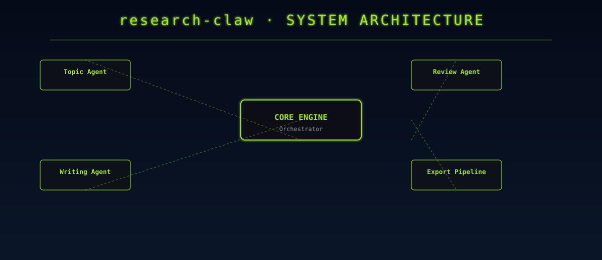

<div align="center">



</div>

# research-claw

*AI research workflow assistant for exploring papers, structuring notes, and drafting literature reviews.*

[](https://python.org/)
[](LICENSE)
[](https://github.com/disdorqin/research-claw/stargazers)
[](https://github.com/disdorqin/research-claw)

---

research-claw is a local-first CLI tool that helps you move from a research topic to a structured literature survey and draft. It coordinates multiple specialized agents — literature search, note structuring, and drafting — to handle the mechanical parts of academic reading and writing, while leaving critical judgment to you.

It is **not** a paper generator, not a source fabricator, and not a replacement for peer review. It is an assistant for the front-loading work: finding and filtering papers, organizing notes, and producing a structured first pass.

## Why

Reading and writing research papers involves a lot of overhead that is well-defined but time-consuming:

- Finding relevant literature and filtering out noise
- Organizing notes across multiple papers into a coherent structure
- Turning scattered annotations into a first draft

research-claw assigns each of these stages to a specialized agent — literature, structuring, and drafting — connected by a config-driven pipeline that you control at each step.

## Features

- **Literature Agent** — given a topic, searches academic sources and produces a structured survey with summaries and references
- **Note Structuring Agent** — takes raw notes or annotations and groups them into thematic sections
- **Drafting Agent** — assembles the structured material into a literature-review first draft following standard academic flow
- **Human-in-the-loop** — quality gates between each stage let you review, edit, and approve before the next agent runs
- **Config-driven** — a single YAML file defines topic scope, search sources, agent behavior, and output format
- **Local-first** — runs on your machine; no data leaves your environment without your explicit intent

## Architecture

<div align="center">
  
</div>

The pipeline is organized as a directed acyclic graph of stages, each of which wraps an agent call with I/O contracts:

1. **Scoping** — reads your config and expands the research direction into search queries
2. **Literature Retrieval** — queries configured sources, deduplicates results, ranks by relevance
3. **Note Structuring** — takes your notes and annotations, organizes them by theme, identifies gaps
4. **Drafting** — produces a structured first draft with introduction, related work, methodology sketch, and references
5. **Review** — checks the draft for internal consistency, missing citations, and structure problems

Each stage produces an intermediate artifact that you can inspect and modify before the next stage runs.

## Prerequisites

- Python 3.10 or later
- An LLM API key (OpenAI, Anthropic, or compatible provider — configured in the YAML)

## Quick Start

```bash
# Clone and install
git clone https://github.com/disdorqin/research-claw.git
cd research-claw
pip install -e ".[dev]"

# Configure your research project
cp config.researchclaw.example.yaml config.researchclaw.yaml
# Edit the config file with your topic, API keys, and search preferences

# Run the pipeline
python -m researchclaw run --config config.researchclaw.yaml
```

## Example: From Topic to Literature Survey

```bash
# 1. Define your research direction
echo "retrieval-augmented generation for domain-specific question answering" > topic.txt

# 2. Run the literature agent to gather and survey relevant work
python -m researchclaw agent:literature --topic topic.txt
# → Produces literature_survey.md with summaries and references

# 3. Provide your notes or annotations
# → Edit notes.md with your own reading notes

# 4. Run the structuring agent to organize notes by theme
python -m researchclaw agent:structuring --survey literature_survey.md --notes notes.md
# → Produces structured_outline.md

# 5. Run the drafting agent to produce a first pass
python -m researchclaw agent:drafting --outline structured_outline.md
# → Produces draft_review.md
```

## Output Format

Each pipeline stage produces a Markdown file in the `outputs/` directory by default:

| Stage | Artifact | Contents |
|---|---|---|
| Literature | `literature_survey.md` | Paper summaries, relevance scores, full references |
| Structuring | `structured_outline.md` | Thematic sections, gap analysis, cross-references |
| Drafting | `draft_review.md` | Literature review first draft with citations |
| Review | `review_report.md` | Consistency checks, missing citations, structure notes |

All artifacts are plain Markdown with YAML front matter for machine-readable metadata (stage name, timestamp, config snapshot).

## Project Structure

```
research-claw/
├── researchclaw/           # Main package
│   ├── agents/             # Agent implementations
│   ├── pipeline.py         # Pipeline orchestrator
│   └── config.py           # Config loading and validation
├── docs/                   # Documentation
│   ├── architecture.md     # Agent pipeline and data flow
│   └── demo.md             # Walkthrough with sample output
├── config.researchclaw.example.yaml  # Config template
├── pyproject.toml          # Project metadata and dependencies
└── README.md               # This file
```

## Documentation

- [Architecture](docs/architecture.md) — agent pipeline and data flow
- [Demo](docs/demo.md) — walkthrough with sample output
- [Roadmap](docs/roadmap.md) — current status and planned features

## Tech Stack

Python · LLM APIs · Academic search APIs · PyYAML

## Roadmap

- [x] Literature retrieval and survey generation
- [x] Note structuring agent
- [x] Config-driven pipeline orchestration
- [x] Human-in-the-loop quality gates
- [ ] Drafting agent with citation formatting
- [ ] Review agent with coverage checks
- [ ] Plugin architecture for custom search sources

## Contributing

See [CONTRIBUTING.md](CONTRIBUTING.md) for guidelines. Issues and pull requests are welcome, especially on:

- Documentation improvements
- Additional literature search sources
- Note-structuring strategies
- Bug reports with reproduction steps

## License

MIT — see [LICENSE](LICENSE).
